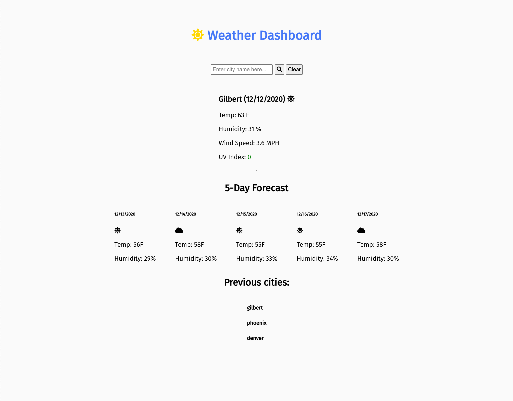

# weather-dashboard

This is a simple web application that uses the [OpenWeather API](https://openweathermap.org/api) to display current weather and a five day forecast for a city based on user input. The application also stores previous searches in local storage and allows the user to click on the city names to display the weather info again.

Please check out the deployed project [here](https://nicholasrokosz.github.io/weather-dashboard/).

